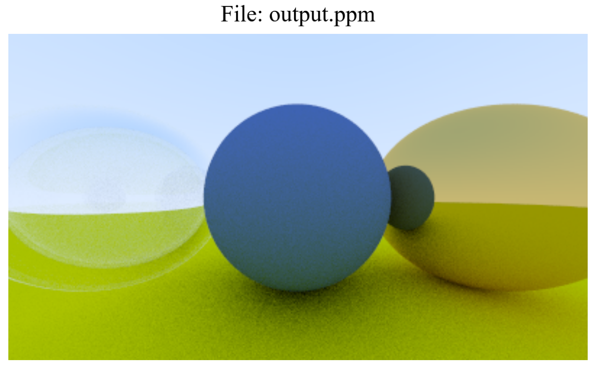

# Rust Ray Tracing in One Weekend

I created this project to practise my Rust skills.

The whole project was created by following the book [_Ray Tracing in One Weekend_](https://raytracing.github.io/books/RayTracingInOneWeekend.html)

You can view PPM image files at [_PPM Reader_](https://www.cs.rhodes.edu/welshc/COMP141_F16/ppmReader.html)

**Note:** The ray tracing algorithm will run on the CPU and can take some time (for me it took 140s).

